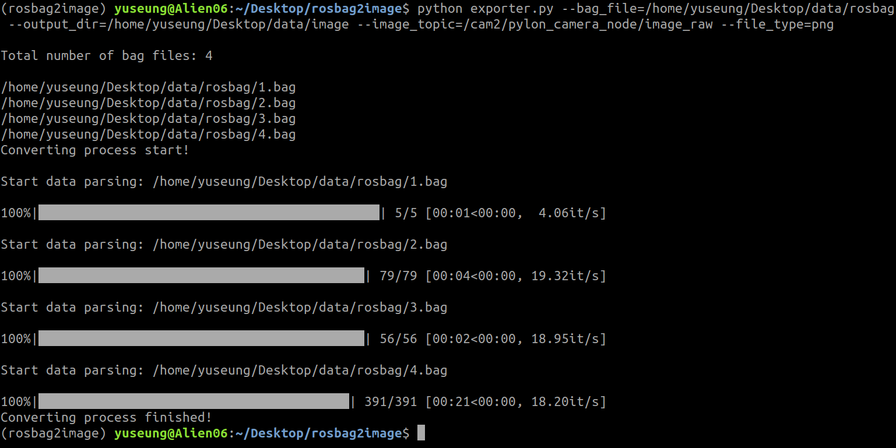

## About

This code is about .bag (ROS bag) to .png or .jpg (image) converting tool.  
You can convert all the .bag files (sorted in ascending order by file name) in the directory.  

## How to use
### 0. Environment
Python 2.7 with Anaconda Envs (Windows not supported) 
`$ conda create -n rosbag2image python=2.7`

### 1. Install python libraries
`$ pip install pycryptodomex`  
`$ pip install gnupg`  
`$ pip install tqdm`   
`$ conda install opencv`

### 2. Launch python file
`$ python exporter.py --bag_file={path of input ROS bag file directory} --output_dir={path of output image file directory} --image_topic={image topic name} --file_type={type of output image (png, jpg)}`

### Parameters
|Name|Description|Default value|
|:---|:---|:---|
|bag_file|.bag file path|"REQUIRED"|
|output_dir|output image file path|"/home/user/image"|
|image_topic|input image topic name|"/image_raw"|
|file_type|image file type|"png"|

### Results
* Terminal


* Directory structure
```
output_dir/  
    │   
    ├── bag1/  
    │   ├── images/  
    │   │   ├── 00000.png  
    │   │   ├── 00001.png  
    │   │   ├── 00002.png  
    │   │   └── ...  
    │   │   
    │   └── meta.csv  
    │   
    ├── bag2/  
    └── ...  
```

